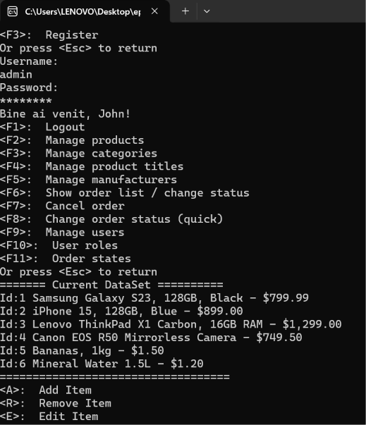
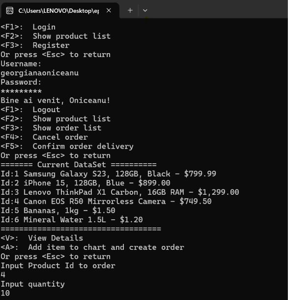

# Console Online Store

A professional console-based application demonstrating a robust 3-tier architecture, implemented in C# (.NET 8). This project simulates an online store where users can browse products, register, and place orders.

## Learning Outcomes & Skills Demonstrated

This project is a solid demonstration of how enterprise-level applications are built. Through building this project, I have gained practical experience with:
- **Clean Architecture (3-Tier)**: Properly separating data access logic (DAL), business logic (BLL), and the user interface (ConsoleApp).
- **Dependency Injection (DI)**: Decoupling components using interfaces and configuring an IoC Container (`Microsoft.Extensions.DependencyInjection`).
- **Repository Pattern**: Managing database entities in a centralized and highly testable manner.
- **Entity Framework Core (In-Memory)**: Using an ORM to write LINQ queries instead of raw SQL.
- **Unit Testing**: Using xUnit and Moq to isolate and test methods in the Business Logic Layer.
- **Data Protection (Hashing)**: Ensuring user passwords are not stored in plain text by transforming them using SHA256 hashing algorithms.

---

## Architecture & Tech Stack

- **StoreDAL (Data Access Layer)**: Handles data persistence using Entity Framework Core. Implements the Repository Pattern for standard CRUD operations.
- **StoreBLL (Business Logic Layer)**: Contains the core business rules and services. Validates operations, calculates state transitions, and coordinates between the DAL and the UI.
- **ConsoleApp (Presentation Layer)**: An interactive console UI built with `ConsoleMenu`. It consumes BLL services injected automatically via DI.

**Technologies Used**: .NET 8, Entity Framework Core (InMemory), xUnit & Moq, Dependency Injection, StyleCop (Code Analysis), GitHub Actions (CI Pipeline).

---

## Features: Admin vs. Client

The application is role-based. Depending on the account you log in with, you have access to entirely different menus and actions.

### Administrator (Ex: admin / admin123)
The administrator has full control over the store's ecosystem. They handle "inventory management" and "order delivery".
- **Manage Inventory**: Can add, delete, and edit Categories (`Manage categories`), Products (`Manage products`), Manufacturers, and Product Titles.
- **Manage Users**: Can view the list of all registered users and change their roles.
- **Process Orders**: The administrator moves the order from the `New Order` phase to `Confirmed`, then to `In Delivery` and eventually `Delivered To Client`. Only the admin can make these state transitions.



### Registered Client (Ex: mary / mary123)
The client uses the store exclusively to buy and track the status of their own orders.
- **Create Orders**: Can browse the product list (`Show product list`), add them to the cart (`Add item to chart and create order`) by specifying the product ID and desired quantity.
- **Order History**: Can view all orders placed by them (`Show order list`) and their current status (e.g., `New Order`, `In Delivery`).
- **Confirm Delivery**: Once the administrator has marked the order as delivered (`Delivered To Client`), the client can validate the completion of the transaction using `Confirm order delivery`.



---

## Getting Started

### Prerequisites
- .NET 8 SDK installed on your system.

### Running the Application
1. Open a terminal in the main directory of the project (where the `.sln` file is located).
2. Run the following command:
   ```bash
   dotnet run --project ConsoleApp
   ```
3. Choose the **Register** option from the Guest Menu to create your own account, or use **Login** with the default testing accounts:
   - **Admin**: `admin` / `admin123`
   - **Client**: `mary` / `mary123`

### Running Tests
The project includes comprehensive unit testing (over 20 tests). To ensure application integrity, run:
```bash
dotnet test
```

## Continuous Integration
This project is connected to a GitHub Actions workflow. On every push, the code is built, the StyleCop syntax analyzer is run, and the xUnit test suite validates the business logic.
